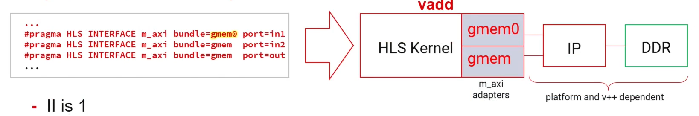
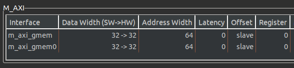
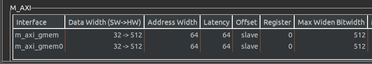
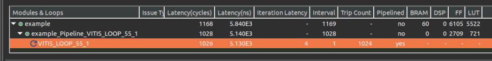
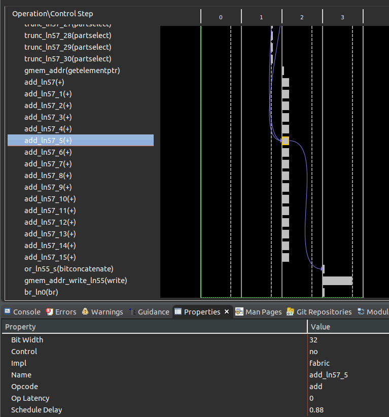
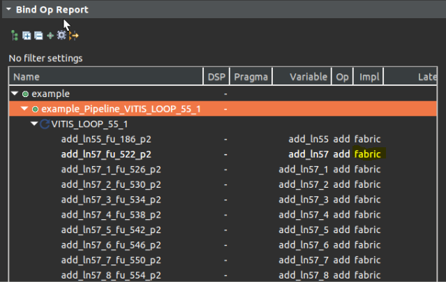
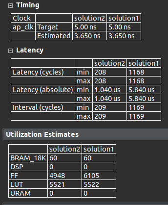
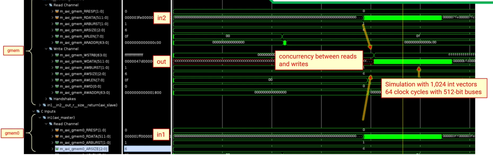

Vitis HLS 在从Vivaido HLS的升级换代中，以axi_master接口为起点的设计正在变得更易上手。其中很重要的一点就是更多的MAXI端口设计参数可以让用户通过指令传达到。 这些参数可以分为两类：

- 静态参数指标：这些参数会影响内存性能，可以在 C 综合期间的编译时从编译的结果中很清楚地知道，突发读写地长度、数据端口宽度加宽、对齐等。
- 动态参数指标：这些参数本质上是动态的，取决于系统。例如，与 DDR/HBM 的通信效率在C综合编译时是未知的。

本文给大家提供利用axi_master接口指令端的几个静态参数的优化技巧，从扩展总线接口数量，扩展总线位宽，循环展开等角度入手。最核心的优化思想就是以资源面积换取高带宽的以便并行计算。熟记这本文几个关键的设计点，让你的HLS内核接口效率不再成为设计的瓶颈！

首先我们看一下这个最基础的设计代码，看看我们应该如何优化带宽。


以上代码在进行了c综合后，我们所有的指针变量都会依据指令的设置映射到axi-master上，但是因为根据指令中所有的端口都绑定到了一条总线gmem上。所以在综合的警告里面会提示：

WARNING: [HLS 200-885] The II Violation in module 'example_Pipeline_VITIS_LOOP_55_1' (loop 'VITIS_LOOP_55_1'): Unable to schedule bus request operation ('gmem_load_1_req', example.cpp:56) on port 'gmem' (example.cpp:56) due to limited memory ports (II = 1). Please consider using a memory core with more ports or partitioning the array.

因为在axi-master总线上最高只能支持一个读入和一个写出同时进行，如果绑定到一条总线则无法同时从总线读入两个数据，所以最终的循环的II=2。解决这个问题的方法就是用面积换速度，我们实例化两条axi总线gmem和gmem0,最终达到II=1.



当总线数量满足了我们并行读入的要求后，读取数据的位宽就成为了我们优化的方向：
因为读取的数据格式是int类型，所以这里的数据位宽就是32bit. 



为了能够转移数据传输瓶颈，在Vitis kernel target flow中，数据位宽在512bit的时候能够达到最高的数据吞吐效率。在Vitis HLS 中的新增了 max_widen_bitwidth 选项来自动将较短的数据位宽拼接到设定的较长的数据位宽选项。在这里我们可以将位宽设置到512bit的位宽，但是同时要向编译器说明，原数据位宽和指定的扩展位宽成整数倍关系。这个操作很简单，在数据读取的循环边界上，用(size/16)*16示意编译器即可。

```C++
#define size 1024

void example(   const unsigned int *int1,
                const unsigned int *int2,
                unsigned int *out)
{
#Pragma HLS INTERFACE mode=m_axi bundle=gmem port=out
#Pragma HLS INTERFACE mode=m_axi bundle=gmem0 port=in2
#Pragma HLS INTERFACE mode=m_axi bundle=gmem port=in1

    for(int i=0;i<(size/16)*16; i++){
        out[i]=in1[i]+in2[i]
    }
}
```

扩展位宽后的结果可以在综合报告的接口部分看到数据位宽已经从32位扩展到512位。



优化到这一步我们的设计可以进行大位宽的同步读写，但是发现循环的trip count还是执行了1024次, 也就是说虽然位宽拓展到512后，还是一个循环周期计算一次32bit的累加。实际上512bit的数据位宽可以允许16个累加计算并行执行。



为了完成并行度的优化，我们需要在循环中添加系数为16的unroll 指令，这样就可以生成16个并行执行累加计算的硬件模块以及线程。

```C++
#define size 1024

void example(   const unsigned int *int1,
                const unsigned int *int2,
                unsigned int *out)
{
#Pragma HLS INTERFACE mode=m_axi bundle=gmem port=out
#Pragma HLS INTERFACE mode=m_axi bundle=gmem0 port=in2
#Pragma HLS INTERFACE mode=m_axi bundle=gmem port=in1

    for(int i=0;i<(size/16)*16; i++){
#Pragma HLS UNROLL factor=16
        out[i]=in1[i]+in2[i]
    }
}
```

在循环中并行执行的累加操作，我们可以从schedule viewer中观察到并行度，可以从bind_op窗口中观察到operation实现所使用的硬件资源，可以从循环的trip_count 降低到了1024/16=64个周期，以及大大缩小的模块的整个latency中得以证明。




最后我们比较了一下并行执行16个累加计算前后的综合结果，可以发现由于有数据的按位读写拆分拼接等操作，整个模块的延迟虽然没有缩短为16分之一，但是缩短为5分之一也是性能的极大提升了。



最后的最后，RTL级别的co-sim仿真才让我们更加确信了数据的从两个并行读写，循环执行的周期减小至了64个时钟周期。



以上内容是设计者在AXI总线接口中使用传统的数据类型时，提升数据传输效率和带宽的一揽子有效方法。 第一：扩展总线接口数量，以便并行读写。第二，扩展总线位宽，增加读写带宽。第三，循环展开，例化更多计算资源以便并行计算。本文的优化方式还是基于内核设计本身的，下一篇文章，，我们将使用Alveo板卡做一些突发传输的实验，深度定制传输需求，以真实仿真波形和测得的传输速度，从系统级别强化我们对于突发读写效率的认知。
