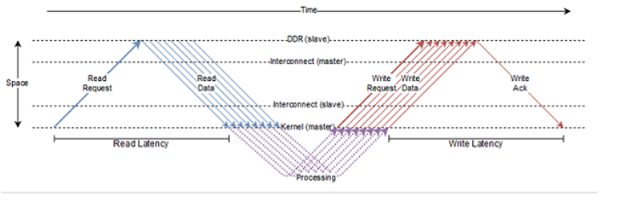
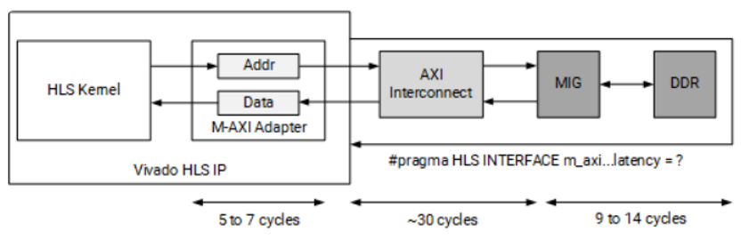

# Controlling AXI4 Burst Behavior

拥有RTL设计经验的设计者可以精准控制AXI 总线的突发读写，随着高层次综合工具的代代提升，Vitis HLS 工具中也可以逐步实现了。当一个C++加速函数的端口被指定为M_AXI时，HLS工具会生成一个AXI 总线适配器，精确地控制读写的效率，吞吐量，延迟等。本文给大家分享系统级别的一些宏观概念以及如何预估 HLS 内核向 DDR 发送突发读写在各个步骤中的延迟。

### Part1: 突发读写系统级别的宏观概念介绍
Bursting Optimization 是一种基于AXI总线的突发读写效率优化，它可以尝试智能地将我们对 DDR 的内存访问的请求聚集起来，以最大化提升吞吐量带宽或者最小化延迟。Bursting 通常对吞吐量可以提供 4-5 倍的改进空间，而其他优化（比如扩展访问端口或 确保DDR数据读写没有依赖性）可以提供更大的性能改进。通常，在有多个内内核在对D​​DR数据的读取有竞争关系并发生争用时，突发读写就有更大的优势。



上图显示了 AXI 协议处理brust length 为8时，AXI总线数据传输的工作原理。读延迟(Read Latency)定义为从发送读请求突发到第一次读突发中的请求被内核接收。类似地，写延迟(Write Latency)被定义为写突发中最后一次写的数据被发送到内核收到写确认之间所花费的时间。读取请求通常在第一个可用机会时发送，而写入请求则排队等待，直到突发中每个写入的数据可用。

为了帮助我们了解系统中可能存在的各种延迟，下图显示了当 HLS 内核向 DDR 发送突发读写时会发生什么。



当我们的设计发出读/写请求时，该请求将通过几个专门的辅助模块发送到 DDR。首先，M-AXI 适配器（Adapter）将在 HLS 内核创建请求的缓冲区。它主要有两大功能：
1. 将大脉冲串切割成较小脉冲串的逻辑（它需要这样做以防止占用通道或如果请求跨越 4 KB 边界，请参阅 AXI 参考指南[UG1037](https://docs.xilinx.com/v/u/en-US/ug1037-vivado-axi-reference-guide)。
2. 停止发送突发请求（取决于最大未完成outstanding请求参数），以便它可以安全地缓冲每个内核的全部数据。这可能会略微增加写入延迟，但可以解决由于内存子系统上的并发请求（读取或写入）而导致的deadlock。 我们可以通过配置config_interface -m_axi_conservative_mode 参数使得 M-AXI 接口先hold所有写入请求，直到所有数据都可用。

通过M-AXI 适配器将花费几个周期的延迟，通常情况为 5 到 7 个周期。然后，请求进入 AXI 互连，该互连将内核的请求发到 MIG，然后最终给到 DDR。通过互连的延迟成本很高，可能需要大约 30 个周期。最后，往返 DDR 可能需要 9 到 14 个周期的成本。以上数据不是对延迟的精确测量，而是用于显示这些专用模块的相对延迟成本的估计值。要进行更精确的测量，我们需要编写特定系统的应用程序，生成[时间线报告(timeline report)](https://docs.xilinx.com/r/en-US/ug1399-vitis-hls/Timeline-Trace-Viewer)来测试和观察这些延迟。

从II的角度估算系统延迟的方法如下：在HLS内核端的数据处理II＝１的前提下，互连的平均 II 为 2，而 DDR 控制器的平均 II 为 4-5 个请求周期。

另外需要提醒大家的是：AXI互连仲裁的策略基于读/写请求的长度大小，因此请求具有较长突发。

长度的数据优先于具有较短突发的请求（从而导致更大的信道带宽被分配给较长的突发，以防发生争用）。当然，较长的突发请求具有阻止其他任何人访问 DDR 的副作用，所以我们在做系统级别的规划的时候，必须在突发长度和减少 DDR 端口争用之间进行取舍。幸运的是，较大的延迟有助于防止某些端口争用，并且请求的有效流水线可以显着提高系统中可用的带宽吞吐量。

### Part2: 玩转AXI总线突发读写的代码风格

在Vitis HLS 工具中，要真正完成AXI总线突发，我们需要一个合适的代码风格并结合恰当的指令设置来达到这个目的。本章节带大家看看如何玩转AXI总线突发读写的代码风格。

HLS编译器所能识别的突发读写有**顺序突发（sequential burst）** 和 **流水线突发（Pipeline burst）**，一般来说顺序突发的读写效率较为低下，大多数情况下可以通过优化代码风格实现高效的流水线突发读写。

#### 1. 首先我们要理解HLS编译器是如何在代码中寻找并判断代码中的突发访问需求的？
	
    - HLS 编译器会在函数的基本块中查找内存访问，例如在函数内部的一组顺序语句中查找内存访问。
    - 假设满足突发的先决条件，在这些基本块中推断出的每个突发称为顺序突发。编译器将自动扫描基本块以将最长的访问序列构建到单个顺序突发中。
    - 然后编译器查看循环并尝试推断所谓的流水线突发。

流水线突发一般是针对的是循环迭代中的读/写序列。编译器试图通过分析循环索引和循环的边界变量来推断突发读写的长度。如果成功解析一个可以突发读写的结构体，编译器可以将循环的每次迭代中的读/写序列链接成一个长流水线突发。目前的Vitis HLS编译器会自动推断代码中是否存在有效的Sequential Burst 或者 Pipeline Burst，但没有办法专门请求顺序或流水线突发。但是设计者们目前如果遵循符合条件的代码风格就能让工具推断顺序或流水线突发。

#### 2. 成功实现突发读写代码风格有哪些要求：
聚合连续的内存访问请求是能够突发读写关键。以下是这些连续访问必须满足的一组先决条件：

    - 必须全部读取，或全部写入 - 突发读取和写入是不可能的。
    - 必须是单调递增的访问顺序（在访问的内存位置和时间方面）。总线无法访问位于两个先前访问过的内存位置之间的内存位置。
    - 在内存中必须是连续的——一个紧挨着另一个，没有间隙或重叠，并且是向前的。
    - 在发出请求之前，必须确定读/写访问的次数（或突发长度）。这意味着即使突发长度是参数化的，也必须在发送读/写请求之前进行计算。
    - 如果将两个数组捆绑到同一个 M-AXI 端口，则在任何给定时间的每个方向最多只对一个数组进行突发。
    - 从发起和完成突发请求的时间开始，不得存在数据依赖性的问题。

下面我们从实际代码出发，看一看不同的代码风格下编译器如何分别流水线突发和顺序突发读写：

以下代码是一个非常典型的从一个数组中执行一系列读取，以及从循环内再对另一个数组进行一系列写入。
```
for(size_t i = 0; i < size; i+=4) {
    out[4*i+0] = f(in[4*i+0]);
    out[4*i+1] = f(in[4*i+1]);
    out[4*i+2] = f(in[4*i+2]);
    out[4*i+3] = f(in[4*i+3]);
}
```

如果编译器可以成功地从循环的边界变量（size）和循环的行程计数推导出突发长度，它将推断出一个大流水线突发并将 ReadReq、WriteReq 和 WriteResp 移动到循环外，如下图的流水线突发伪代码所示。因此，所有循环迭代的读请求合并为一个读请求，所有写请求合并为一个写请求。这里要注意的是，所有读取请求通常会立即发出，而写入请求仅在数据可用后才会发出。
```
/* requests can move anywhere in func */
rb = ReadReq(in, size); 
wb = WriteReq(out, size);
for(size_t i = 0; i < size; i+=4) {
    Write(wb, 4*i+0) = f(Read(rb, 4*i+0));
    Write(wb, 4*i+1) = f(Read(rb, 4*i+1));
    Write(wb, 4*i+2) = f(Read(rb, 4*i+2));
    Write(wb, 4*i+3) = f(Read(rb, 4*i+3));
}
WriteResp(wb);
```
但是，如果不满足任意一个上文所提到的突发传输的先决条件，编译器可能不会推断流水线突发，而是会尝试推断顺序突发，其中 ReadReq、WriteReg 和 WriteResp 位于读/写访问被突发优化，如顺序突发代码下面的伪代码片。在这种情况下，每次循环迭代的读和写请求都在一个循环内合并为一个读或写请求。很显然，顺序突发一次只能聚合4个读写需求，所以效率是低下的。
```
for(size_t i = 0; i < size; i+=4) {
    rb = ReadReq(in+4*i, 4);
    wb = WriteReq(out+4*i, 4);
    Write(wb, 0) = f(Read(rb, 0));
    Write(wb, 1) = f(Read(rb, 1));
    Write(wb, 2) = f(Read(rb, 2));
    Write(wb, 3) = f(Read(rb, 3));
    WriteResp(wb);
}
```
提示：突发请求的大小可以进一步划分为用户指定大小的多个请求，这些请求使用 INTERFACE pragma 或指令的 max_read_burst_length 和 max_write_burst_length 进行控制，会在以后的文章中详细叙述。

#### 3. 导致编译器流水线突发推理失败的情况有哪些？
	
- 由于重复的内存访问导致的外流水线突发失败

    在以下示例中，外循环L1突发推理将失败，因为循环 L1 的迭代 0 和迭代 1 访问数组 a 和 b 中的相同元素。突发推断是一种全有或全无类型的优化 - 该工具不会推断部分突发。因为突发读写推断的算法的宗旨是试图最大化突发的长度。编译器突发推断将尝试以自下而上的方式 - 从内循环到外循环，并在不满足其中一个前提条件时停止。在下面的示例中，当看到元素 8 再次被读取时，突发推断将停止，因此在这种情况下将推断出长度为 9 的内部流水线突发。
```
    L1: for (int i = 0; i < 8; ++i)
    L2: for (int j = 0; j < 9; ++j)
            b[i*8 + j] = a[i*8 + j];

    itr 0: |0 1 2 3 4 5 6 7 8|
     1: | 8 9 10 11 12 13 14 15 16|
```
- 任意精度类型的循环的边界变量类型也在一定程度上影响突发推断：

    使用 ap_int/ap_uint 类型作为循环边界变量
    由于突发推理取决于循环归纳变量和行程计数，因此使用非本机类型可能会阻碍优化的触发。建议始终使用无符号整数类型作为循环归纳变量。

- 循环边界值的大小无法保证至少进入循环一次

    在某些情况下，编译器可能无法推断出循环归纳变量的最大值N永远不会为零——也就是说，如果它不能证明总是会进入循环。在这种情况下，增加一个assert (N > 0) 的语句表达将帮助编译器推断出这一点。

    ```
    assert (N > 0);
    L1: for(int a = 0; a < N; ++a) { … }
    ```
- 数组的内部或循环主体存在读写依赖

    如果我们写入一个数组位置，然后在同一次或下一次迭代中从中读取，则这种类型的数组依赖性对于编译器的优化来说可能难以破译。基本上，对于这些情况，优化将失败，因为它不能保证写入会在读取之前发生。

- 访问内存的循环主体中存在条件判断语句

    如果内存访问是有条件地进行，则可能导致编译器突发推理算法失败，因为它无法通过条件语句进行推理。在某些情况下，编译器会简化条件甚至删除它，但通常建议不要在内存访问周围使用if条件语句。

- HLS 编译器无法分析循环内部调用的函数中进行的 M-AXI 访问

    HLS编译器并不擅长Cross function 的数组访问分析。在这种情况下，用户可以使用 INLINE 编译指令内联函数以避免无法突发读写的问题。

- Dataflow循环内部的流水线突发推理

    内部具有 DATAFLOW pragma 指令的循环不支持突发推理。 因为任务级的数据流循环内的每个进程/任务都可能有突发。 此外，DATAFLOW 指令允许了这些任务可以并行执行，所以数据流区域内不支持共享 M-AXI 端口。

#### 4.分析以下函数无法推导出流水线突发的原因哪些呢？

```C++
void my_function(hls::stream<T> &out_pkt, int *din, int input_idx) {
    T v;
    v.data = din[input_idx];
    out_pkt.write(v);
}

void my_kernel(hls::stream<T> &out_pkt,
               int            *din,
               int            num_512_bytes,
               int            num_times) {
#pragma HLS INTERFACE mode=m_axi port = din offset=slave bundle=gmem0
#pragma HLS INTERFACE mode=axis port=out_pkt
#pragma HLS INTERFACE mode=s_axilite port=din bundle=control
#pragma HLS INTERFACE mode=s_axilite port=num_512_bytes bundle=control
#pragma HLS INTERFACE mode=s_axilite port=num_times bundle=control
#pragma HLS INTERFACE mode=s_axilite port=return bundle=control

unsigned int idx = 0;
L0: for (int i = 0; i < ntimes; ++i) {
    L1: for (int j = 0; j < num_512_bytes; ++j) {
#pragma HLS PIPELINE
        my_function(out_pkt, din, idx++);
    }
}
```
- 首先非常明显的是内存访问是从被调用的函数my_function中进行的。这里建议用户对任何此类访问 M-AXI 存储器的函数使用inline指令，因为inline指令可以消除嵌套函数之间的层次结构，便于HLS分析突发推理。

- 在此示例中突发推理将失败的另一个原因是通过 my_function 中的 din 访问的内存由变量 (idx) 定义，该变量不是循环归纳变量 i 和 j 的函数，因此可能不是单调递增或递减的。应该使用 (i*num_512_bytes+j) 代替传递 idx。

最后我们给出一些借助软件本身Vitis HLS的综合报告，寻找找到突发读写优化的方向的方法。
在Vitis HLS 中，对于给定的内核，HLS 编译器将突发分析优化实现为多通道优化，但这样的分析是基于每个函数，而不是总体设计。也就是说突发分析优化仅针对一个函数完成，不支持跨函数的突发优化。 Vitis HLS的Synthesis Summary 报告中增加了Bursting Optimizationde 板块，还报告了那些可以突发优化的机会错过了，以帮助我们改进突发读写的优化。

本篇内容从理论层面分析了HLS编译器如何寻找理解突发访问出发，提出了顺序突发和流水线突发两种概念，分析了哪些错误的代码风格会阻止突发推理。下一篇文章中，我们将着重分析如何在Vitis HLS中利用指令精准控制AXI协议的突发读写，以资源面积换取高吞吐量，提高数据传输握手效率。
