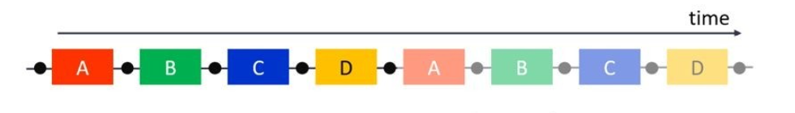
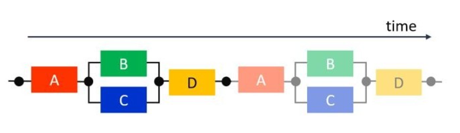
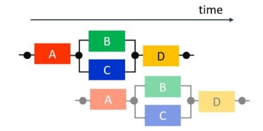
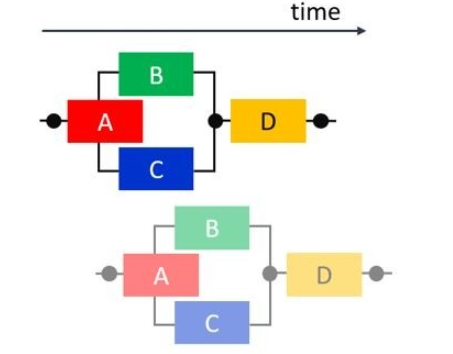

# Coarse-grained Task level parallel optimization | Dataflow

提取实现任务级（task_level）的硬件并行算法是设计高效的HLS IP内核的关键。在本文中，我们将重点放在如何能够在不需要特殊的库或类的情况下修改代码风格以实现C代码实现并行性。 Xilinx HLS编译器的显着特征是能够将任务级别的并行性和流水线与可寻址的存储器PIPO或FIFO相结合。本文首先概述了任务级并行的场景，使用形象生动的比喻介绍了提升并行方式的思想，然后给出了五种无法dataflow的违例代码，提出了代码风格的优化方式，最后推出适用于Vitis HLS 的Dataflow优化的两种规范形式（canonical forms），一种代码风格直接应用于函数，另一种代码风格应用于for循环。

我们理解任务级并行的时候可以想象成这样一个场景，每一个计算任务都是时间轴上向前奔跑的马车，马车与马车之间传输的货物就像是计算数据，他们需要管道去连接即FIFO 和 PIPO, FIFO是一个先进先出存储器也就是说使用这样的管道传输数据的时候，数据进出的顺序不可以改变。而PIPO就是一个可寻址的存储器管道，数据在任务之间进出的顺序可以改变。

最糟糕的状态是什么？马车在时间线上顺序出发，A马车到达终点后B再出发以此类推，就像是CPU中的单进程顺序执行模式一样，而FPGA中有可供并行化执行的数据传输管道，更多的资源就像是跑道一样，所以这个状态效率是最低的。



那么先做一点点改进，我们分析发现B和C马车不享有任何公用的数据或存储计算资源，也就是他们完全可以在A结束后并行执行，最后再执行D，这种并行情况中含有顺序和并行两种模式，我们称之为交叉并行（fork-join parallelism), 但是下一次进程仍然是顺序执行的。



继续深入可以发现，四辆马车在跑完各自的任务后都有一段的闲置时间，提高吞吐量和资源重复利用也很明显是息息相关的。实现了进程之间的流水线执行的结果就如下图，每一辆马车在不同的进程中连续执行任务，向前奔跑，重复利用资源的同时它提升了吞吐量进而极大的减小了完成多个进程后的延迟。



最理想的状态时什么？就是马车尽可能的一个挨着一个一起出发，并行奔跑，大家先后到达终点完成计算，在奔跑的过程中数据通过管道也完成了迁移，最终计算完的数据在最后一辆马车到达终点的时候产出。下图我们可以看到B和C开始执行的时间提前了，并没有等到A完全执行完毕，这和数据依赖息息相关，也就是说我们进一步挖掘并行性的路上发现 ：ABC三辆马车都可以在增加马车数量（扩增资源），建立数据管道的并行执行的前提下实现了。我们用资源换取了更大的并行性，这就是继续挖掘并行性上需要付出的代价。



奔跑的马车带着我们理解了任务级流水线的优化之路，下面我们结合代码看一看HLS工具会在哪些情况下阻止dataflow的实现。
在我们谈及dataflow的优化之前，我们先去了解在HLS提醒你报错的方式，其中修改属性config_dataflow -strict_mode  (off | error | warning）指令可以控制报错指令的级别，一般情况下默认是warning级别的报错，主要看我们的并行性需求。
以下是阻止任务级别并行性的常见情况：
### 1. 单产出单消耗模型违例（Single-producer-consumer violations）
为了使Vitis HLS执行DATAFLOW优化，任务之间传递的所有元素都必须遵循单产出单消耗模型。每个变量必须从单个任务驱动，并且只能由单个任务使用。 在下面的代码示例中是典型的单产出单消耗模型违例，单一的数据流temp1同时被Loop2和Loop3消耗。要解决这个问题很容易，就是将两个任务都要消耗的数据流复制成两个，如右图的Split函数。当temp1数据流被复制为temp2和temp3后，LOOP1，2，3就可以实现任务级流水线了。

```c++
void foo(int data_in[N], int scale, int data_out1[N], int data_out2[N]) {
int temp1[N];
  Loop1: for(int i = 0; i < N; i++) {
    temp1[i] = data_in[i] * scale;
  }
  Loop2: for(int j = 0; j < N; j++) {
    data_out1[j] = temp1[j] * 123;
  }
   Loop3: for(int k = 0; k < N; k++) {
   data_out2[k] = temp1[k] * 456;
  }
}
```

### 2. 旁路任务 Bypassing Tasks  
正常情况下我们期望流水线任务是一个接着一个的产出并消耗，然而像下面这个例子中，Loop1 产生了Temp1和Temp2 两个数据流，但是在下一个任务Loop2中只有temp1参与了运算，而temp2就被旁支了。Loop3任务的执行依赖Loop2任务产生的temp3数据，所以Loop2和Loop3因为数据依赖的关系无法并行执行。

```c++
void foo(int data_in[N], int scale, int data_out1[N], int data_out2[N]) {
 int temp1[N], temp2[N]. temp3[N];
   Loop1: for(int i = 0; i < N; i++) {
     temp1[i] = data_in[i] * scale;
     temp2[i] = data_in[i] >> scale;
 }
 Loop2: for(int j = 0; j < N; j++) {
     temp3[j] = temp1[j] + 123;
 }
 Loop3: for(int k = 0; k < N; k++) {
     data_out[k] = temp2[k] + temp3[k];
 }
}
```
这种情况该怎么办呢？任务流水的效率降低了但是并无实质性报错，这是就要提防Temp2在等待时候，数据存储的管道的深度要足够。
PIPO管道的默认存储深度是2，这里我们加深到3，每加深一个深度意味着多消耗一整个temp2[N]数组的存储资源。加深的数值也会随着被旁支的任务数量变化。
```c++
#pragma HLS STREAM off variable=temp2 depth=3 
```

### 3. 任务间双向反馈Feedback between Tasks

假如说当前任务的结果，需要作为之前一个任务的输入的话，就形成了任务之间的数据反馈，它打乱了流水线从上级一直往下级输送数据流的规则。这时候HLS就会给出警告或者报错，有可能完成不了dataflow优化了。 有一种特例是支持的：使用hls::stream格式的数据流反馈。
我们分析以下代码的内容：
当第一个程序firstProc执行的时候，hls::stream格式的数据流forwardOUT被写入了初始化为10的数值fromSecond 。由于hls::stream格式的数据本身不支持初始化操作，所以这样的操作避免了违反单产出单消耗原则。之后的迭代里，firstProc通过backwardIN接口从hls :: stream读取数值写入forwardOUT中。

在第二个程序secondProc执行的时候，secondProc读取forwardIN上的值，将其加1，然后通过按执行顺序倒退的反馈流将其发送回FirstProc。从第二次执行开始，firstProc将使用从流中读取的值进行计算，并且两个过程可以使用第一次执行的初始值，通过正向和反馈通信永远保持下去。这种交互式的反馈中，包含数据流的双向反馈机制，但是它就像货物一直在从左手倒到右手再从右手倒到左手一样，可以不违反Dataflow的规范，一直进行下去。

```c++
#include "ap_axi_sdata.h"
#include "hls_stream.h"
void firstProc(hls::stream<int> &forwardOUT, hls::stream<int> &backwardIN) {
    static bool first = true;
    int fromSecond;
       //Initialize stream
    if (first)
        fromSecond = 10; // Initial stream value
    else
       //Read from stream
       fromSecond = backwardIN.read(); //Feedback value
       first = false;
       //Write to stream
      forwardOUT.write(fromSecond*2);
}
void secondProc(hls::stream<int> &forwardIN, hls::stream<int> &backwardOUT)
{
      backwardOUT.write(forwardIN.read() + 1);
}
void top(...) {
    #pragma HLS dataflow
     hls::stream<int> forward, backward;
     firstProc(forward, backward);
     secondProc(forward, backward);
}
```

### 4. 含有条件判断的任务流水
DATAFLOW优化不会优化有条件执行的任务。 下面的示例展现了这个违例。 在此示例中，有条件地执行Loop1和Loop2会阻止Vitis HLS优化这些循环之间的数据流，因为sel 条件直接控制了任务中的数据有可能不会从一个循环流到下一个循环。

```c++
void foo(int data_in1[N], int data_out[N], int sel) {
      int temp1[N], temp2[N];
    if (sel) {
     Loop1: for(int i = 0; i < N; i++) {
       temp1[i] = data_in[i] * 123;
       temp2[i] = data_in[i];
     }
    } else {
    Loop2: for(int j = 0; j < N; j++) {
       temp1[j] = data_in[j] * 321;
       temp2[j] = data_in[j];
     }
    }
    Loop3: for(int k = 0; k < N; k++) {
       data_out[k] = temp1[k] * temp2[k];
    }
}
```

但是我们都知道，其实这些任务之间存在条件判断和选择是非常常见的情况，只需要稍微改变代码风格就可以既保留条件判断，又完成任务流水。为了确保在所有情况下都执行每个循环，我们将条件语句下变化的Temp1移入第一个循环。 这两个循环始终执行，并且数据始终从一个循环流向下一个循环。

```c++
void foo(int data_in[N], int data_out[N], int sel) {
 int temp1[N], temp2[N];
    Loop1: for(int i = 0; i < N; i++) {
       if (sel) {
            temp1[i] = data_in[i] * 123;
        } else {
            temp1[i] = data_in[i] * 321;
        }
      }
    Loop2: for(int j = 0; j < N; j++) {
        temp2[j] = data_in[j];
        }
     Loop3: for(int k = 0; k < N; k++) {
        data_out[k] = temp1[k] * temp2[k];
      }
    }
```

### 5. 有多种退出机制的循环
含有多种退出机制的循环不能被包含在流水线区域内， 我们来数一数Loop2一共有多少种循环退出条件：
- 由for循环定义的 K>N 的情况；
- 由switch 条件定义的default情况；
- 由switch 条件定义的continue情况

由于循环的退出条件始终由循环边界定义，因此使用break或continue语句将禁止在DATAFLOW区域中使用循环。

```c++
void multi_exit(din_t data_in[N], dsc_t scale, dsel_t select, dout_t
   data_out[N]) {
    dout_t temp1[N], temp2[N];
    int i,k;
   Loop1: 
     for(i = 0; i < N; i++) {
        temp1[i] = data_in[i] * scale;
        temp2[i] = data_in[i] >> scale;
    }
   Loop2: 
   for(k = 0; k < N; k++) {
      switch(select) {
        case 0: data_out[k] = temp1[k] + temp2[k];
        case 1: continue;
      default: break;
   }
   }
}
```

我们理解了可能阻止任务流水线的5种经典情况后，我们最后推出适用于Vitis HLS 的Dataflow优化的两种规范形式（canonical forms），一种直接应用于函数，一种应用于for循环。我们可以发现规范形式严格遵守了单产出单消耗的规则。
1. 适用于子程序没有被内联（inline）的规范形式

```c++
void dataflow(Input0, Input1, Output0, Output1)
{
 #pragma HLS dataflow
 UserDataType C0, C1, C2;
 func1(read Input0, read Input1, write C0, write C1);
 func2(read C0, read C1, write C2);
 func3(read C2, write Output0, write Output1);
}
```

2.  适用于循环体内的任务流水的规范形式：
对于for循环（其中没有内联函数的地方），循环变量应具有：
- 在for 循环的标题中声明初始值，并设置为0。
- 循环条件N是一个正数值常数或常数函数参数。
- 循环的递增量为1。
- Dataflow 指令必须位于循环内部。

```c++
void dataflow(Input0, Input1, Output0, Output1)
{
   for (int i = 0; i < N; i++)
    {
    #pragma HLS dataflow
      UserDataType C0, C1, C2;
      func1(read Input0, read Input1, write C0, write C1);
      func2(read C0, read C0, read C1, write C2);
      func3(read C2, write Output0, write Output1);
    }
 }
```

有关Dataflow 指令的原理，设计准则和规范形式都在本文讲解给大家了，更多设计例程可以参考以下例子，如有疑问欢迎交流! https://github.com/Xilinx/Vitis-HLS-Introductory-Examples/tree/master/Dataflow

