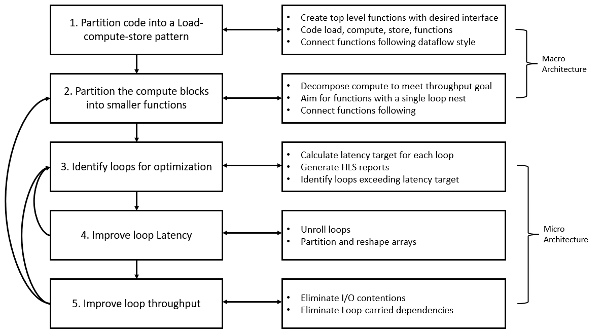

# Designing Efficient Kernels

对于负责实现 Vitis™ 内核的设计师而言，处理 FPGA 器件上可用的器件存储器（PLRAM、HBM 和 DDR）时，有多方面因素需要折衷考量。以下是为应用设计 AXI4 存储器映射接口时使用的最佳实践检查表。

如果首要的最优化目标是吞吐量，那么显而易见，第一步是使用宏架构和微架构最优化来加速应用的计算部分，但往来内核进行数据传输所耗用的时间也会影响与吞吐量目标相关的应用架构。由于数据传输的高开销，考虑如何将计算与应用中存在的通信（数据移动）加以重叠就显得尤为重要。下图展示了设计高效内核从宏观到微观的设计步骤：

- 通过如下方式来分解内核算法：构建生产者 - 使用者任务并以加载、计算和存储 (LCS) 编码模式来对任务进行建模
    - 所有外部 I/O 访问都必须包含在加载和存储任务中。
    - 如果内核需要并行读取或写入不同端口，则应存在多个加载或存储任务。
    - 计算任务应仅包含标量、阵列、串流或块串流实参。
    - 请确保这全部三项任务（指定为函数）都能以重叠方式来执行（由编译器启用任务级并行操作）。
    - 计算任务能够进一步拆分为更小的计算任务，这样即可包含进一步的最优化操作（例如，流水打拍）。适用于 LCS 的这些规则同样适用于这些较小的计算函数。
    - 请始终使用本地存储器来通过计算任务进行数据的往来传递。
- 加载和存储块负责在全局存储器与计算块之间以尽可能高效的方式移动数据。
    - 一方面，这些块必须根据内核内部的计算任务强制要求的（时间）顺序通过串流接口来读取或写入数据
    - 另一方面，这些块必须根据软件应用所设置的（空间）排列顺序通过存储器映射接口来读取或写入数据
- 利用 HLS 构建正确的硬件设计的关键是改变我们对于数据访问的思维模式
    - 在软件中，用户经常会思考数据“访问”方式（算法提取所需的数据）。
    - 在硬件中，思考数据“流经”算法的方式则更为有效（数据推送到算法）
    - 在软件中，用户需要推理阵列索引以及“在何处”访问数据
    - 在硬件中，用户需要推理串流及“何时”访问数据
- 全局存储器的访问时间更长（DRAM 和 HBM），并且带宽有限 (DRAM)。为了减少访问全局存储器的开销，接口函数需要
    - 高效访问大型连续数据块（以便通过[突发传输](https://docs.xilinx.com/r/en-US/ug1399-vitis-hls/AXI-Burst-Transfers)来获益）
    - 相比随机访问和/或无需数据（突发传输分析在此情况下将失败），顺序访问数据的突发传输更高（数据吞吐量效率更高）
    - 避免冗余访问（节省带宽）
- 数据顺序出入计算任务大多数情况下与全局存储器中的数据排列顺序不同。
    - 在此情况下，接口函数最优化需要创建内部高速缓存结构以便收集充足的数据，并对其加以相应组织，从而尽可能减少全局存储器访问开销，同时仍能满足串流接口所期望的顺序
        - 示例：[2D 卷积](https://github.com/Xilinx/Vitis-Tutorials/blob/4c1464c3e347fc2db33e633271350ba33df11b89/Hardware_Acceleration/Design_Tutorials/01-convolution-tutorial/src/filter2d_hw.cpp)
    - 为了简化数据移动逻辑，开发者还可思考如何通过不同方法将数据存储到存储器中。例如，通过以列为主的方式来访问 DRAM 中的数据效率非常低。相比在内核中实现专用数据移动器，在软件中对数据进行转置并改用以行为主的方式来存储将显著简化硬件访问模式，因此这种方式更有效。
- 请尽可能增大接口的端口宽度，将每个 AXI 端口的位宽设置为 512 位（64 个字节）。
    - 使用[hls::vector](https://docs.xilinx.com/r/zh-CN/ug1399-vitis-hls/%E7%9F%A2%E9%87%8F%E6%95%B0%E6%8D%AE%E7%B1%BB%E5%9E%8B)或 [ap_(u)int<512>](https://docs.xilinx.com/r/zh-CN/ug1399-vitis-hls/AXI-%E7%AA%81%E5%8F%91%E4%BC%A0%E8%BE%93) 作为端口的数据类型，以便推断最大突发传输长度。在接口中使用结构体可能导致突发传输性能欠佳。
    - 访问全局存储器开销极大，因此增大访问的数据字大小更为有效。
    - 请将接口端口想象成用于向内核馈送数据的管道。管道越宽，那么可供访问和处理的数据就越多，发回的数据也就越多。
    - 从全局器件存储器传输大型数据块。一次大规模传输要比多次小规模传输效率更高。带宽受 PCIe 性能限制。请运行[DMA 测试](https://docs.xilinx.com/r/2021.2-English/ug1393-vitis-application-acceleration/dmatest)以测量 PCIe® 传输的最大有效吞吐量。通常，读取和写入的最大吞吐量各自均在 10-17 GB/sec 范围内。
        - 存储器资源包括 PLRAM（小尺寸，快速访问，时延最低）、HBM（中等尺寸，中等访问速度，存在一定时延）和 DRAM （大尺寸，访问速度较慢，高时延）。
        - 鉴于读取本质上是异步操作，因此快速缓冲的理想选择是分布式 RAM。我们可立即使用读取的值，而无需等待至下一个时钟周期。我们也可以使用分布式 RAM 来创建小型 ROM。但分布式 RAM 不适合大型存储器，使用块 RAM 和 UltraRAM 能够为大小超过 128 位的存储器提升性能（并降低功耗）。
- 确定并发端口的最优数量，即并发 AXI 存储器映射端口的数量
    - 如果加载任务需要获取多个输入数据集以供馈送给计算任务，那么它可选择使用多个接口端口来并行访问此数据。
    - 但此数据需要存储在不同的[memory banks](https://github.com/Xilinx/Vitis-Tutorials/blob/c6226467aff75d9647c45ef82e918e585496b76c/Runtime_and_System_Optimization/Feature_Tutorials/01-mult-ddr-banks/README.md)中，或者需要顺序访问。如有 [32 条 HBM 通道](https://github.com/Xilinx/Vitis-Tutorials/tree/c6226467aff75d9647c45ef82e918e585496b76c/Runtime_and_System_Optimization/Feature_Tutorials/04-using-hbm)，那么 FPGA 上有最多 4 个 DDR 存储体。
    - 当有多个进程访问同一个存储器端口或存储体时，仲裁器将把对同一个存储器端口或存储体执行的并发访问转变为顺序访问。
- 为每个 AXI 端口设置正确的突发传输长度，即最大突发传输访问长度（以元素数量来表示）。
    - 设置与最大 4k 字节传输相等的突发传输长度。例如，使用的 AXI 数据宽度为 512 位（64 个字节）时，突发传输长度应设置为 64。
    - 以突发传输方式传输数据可隐藏存储器访问时延，并提高存储器控制器的带宽使用率和效率
    - 按此方式编写应用代码能够为往来全局存储器的读取和写入推断最大突发传输长度
- 设置 AXI 端口在停滞前可维持的outstanding memory requests的数量。
    - 设置合理的[outstanding memory requests](https://docs.xilinx.com/r/en-US/ug1399-vitis-hls/AXI-Performance-Case-Study)使系统能在停滞前提交多个存储器请求，这种请求流水打拍方式允许系统隐藏部分存储器时延，但代价是 BRAM/URAM 资源数增加。