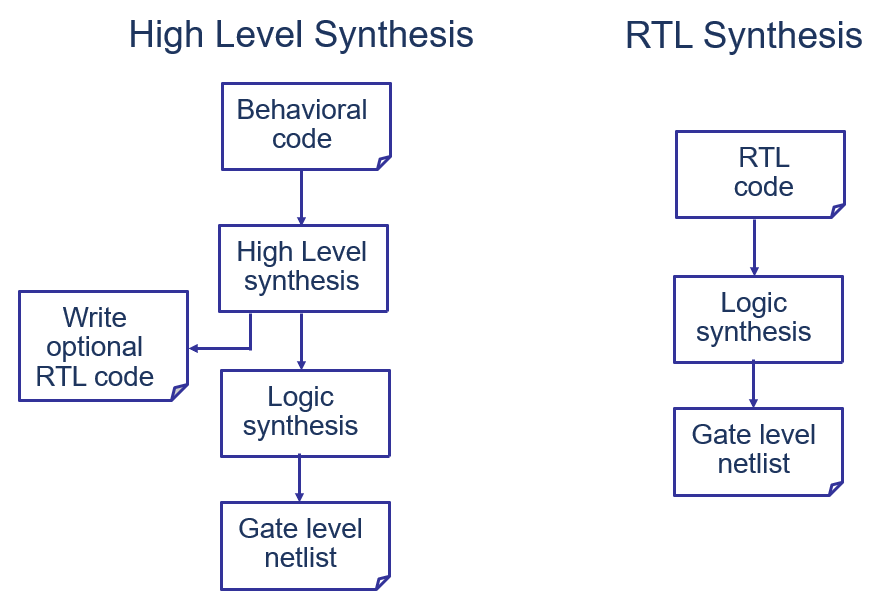
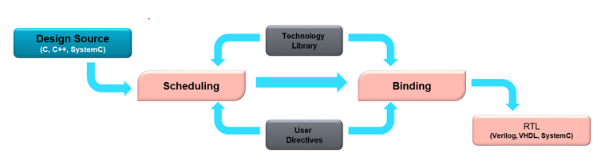
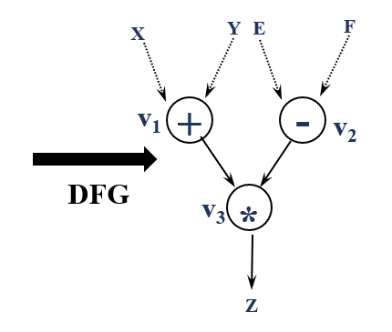
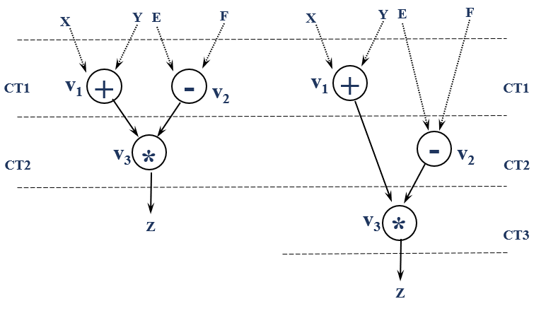
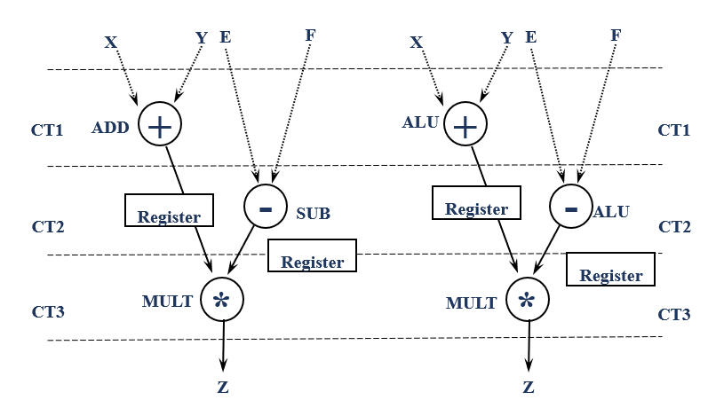
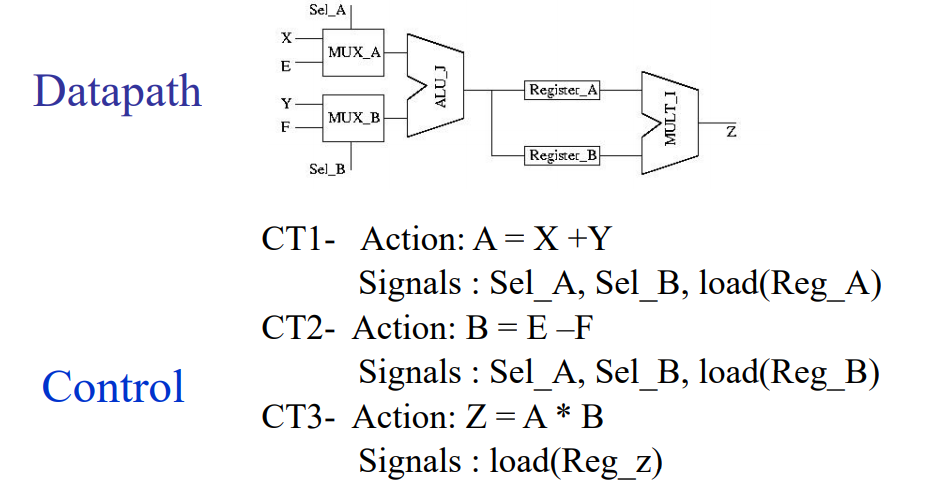

# Overview on High-level synthesis technology

说起高层次综合技术（High-level synthesis）的概念，现在有很多初学者简单地把它理解为可以自动把c/c++之类地高级语言直接转换成底层硬件描述语言（RTL）的技术。其实更准确的表述是：由更高抽象度的行为描述生产电路的技术。高层次的概念代表的是硬件描述语言里面较高的抽象层次，随着软件硬件语言的共同发展，高抽象度的行为描述语言来到了C/C++的层级。以下是南加州大学的DANIEL D.GAJSKI教授在1994年出版的期刊时对高层次综合技术的描述[1]：High-level synthesis systems start with an abstract behavioral specification of a digital system and find a register-transfer level structure that realizes the given behavior. 下图揭示了高层次综合工作的基本流程，以及它于传统的RTL综合流程的对比。接下来将对行为描述，行为综合，分析与优化三个主要子流程详细描述。

 

1. 行为描述

当我们把HLS技术的起点立为一种行为描述语言的时候，就需要软件语言遵循特定的行为描述规范，并且剔除一些源自于软件系统的的思维理念。虽然各个HLS工具的行为综合都有自己的规范，但是关于动态内存分配的约束是共通的：禁止递归和动态指针。
函数递归意味着需要能够动态生成电路模块，动态指针是指运行时指针值可以任意变化的指针变量。 硬件不像软件具有大块的主内存，只有分布在局部的内存，所以比较适合并行实现。动态指针要求作为对象的访问实体在运行时变化，超出了数字电路概念的一种功能。同样，超出了数字电路概念的还有管理系统内存分配的系统调用函数等，在此不一一列举了。

行为描述的概念，让我们明确了针对数字电路特性使用高层次语言去编写行为代码的这一设计基本准则。而后探讨代码风格（coding style）,系统优化都由这一基本准则延申。这就是为什么我们写的C语言代码会有一种介于硬件与软件设计风格之间的根本原因。行为描述的基本对象有输入输出接口，数据位宽，并行化描述等等，在 Vitis HLS 中有行为描述的规范和推荐的写法等等，在展开介绍之前，我们先明确行为综合的流程。

2. 行为综合

在行为综合的过程中，行为描述中使用的变量，数组，运算分别用寄存器(FF,LUT)，局部内存(URAM,BRAM,DRAM)，运算器（DSP，ALU）等数字电路单元来实现。行为描述中的处理流程（顺序执行, 分支，循环则以有限状态机（FSM）的形式来呈现。通过分析行为描述，可以将运算的依赖关系表示为数据流图（DFG），将控制流程表示为控制流图（CFG）。

分析到这里两个非常重要的行为综合概念出现了，就是调度（scheduling）和绑定（Binding）.
根据数据流图和控制流图来决定运行顺序和运行速度的过程称为调度。
将变量和运算映射到寄存器或运算器的过程称为绑定。

下图简洁明了地介绍了从C语言设计到导出RTL设计过程中，依据HLS库和用户指令进行调度和绑定的过程。

这里我们使用一个非常简单的例子描述一下行为综合的过程
- Compilation and Transformation 将一个行为描述代码的转化为数据流图DFG 

     数据流图由很多数据节点组成，最重要的是表达出了各个节点上数据的依赖关系，这是后面调度和绑定的基础。
     在这个步骤中，代码风格是一个比较关键的因素。HLS在转化过于繁复高层次语言表达的时候，极个别情况会无法识别一些嵌套非常深的软件算法,也会增加编译时间. 所以尽量简洁，逻辑明晰的硬件友好代码会提升开发效率。

- Scheduling 调度

    在数据流图中，我们看到XY和EF数据之间没有依赖，他们可以选择在同一个Control Step里面并行执行,或者在两个CT里面顺序执行.
    这个过程中调度的并行性由HLS编译器，用户指令共同作用影响着，比如编译器会主动发现可以并行的优化点自动优化，也会误以为某些表达式存在数据依赖无法并行优化等，所以仍需要用户加入指令说明情况。 当然追求更高的并行性对资源也有更大的需求，所以并不是一切调度都以最大并行性为目标。

- Binding 绑定

    在早期的HLS研究中，Allocation 和 Binding 是分开的两个步骤。其中Allocation 锁定了资源的数量和类型，Binding完成了运算到资源的映射。现在我们就统称这些操作在Binding步骤完成。早期FPGA中的含有一种集成的算法单元ALU，如今DSP这样的硬件模块已经包含了ALU和乘法器模块等等。
    下图基于早期的ALU单元揭示了Binding 的可能性, 将加减法操作映射到寄存器还是ALU模块，呈现了两种不同的方案.

    以下是选择了使用一个ALU、两个寄存器、一个乘法器的综合结果。对于既定的调度方案，可以通过行为综合来生成相应的状态机。HLS在行为综合的过程中，除了达到算法的基本功能，更重要的是选择不同的绑定和调度方案在资源、性能、吞吐量等各个指标中做权衡和取舍。

3. 分析和优化

电路的规模和运行时间存在权衡关系，所以产生最优化的RTL描述需要开发者提供大致的优化方针，甚至是明确的优化仿真。
因此Xilinx的高层综合工具提供了一系列性能评估的功能和向编译器指向优化方式的途径。针对行为描述进行行为综合,可以获取如下多种性能指标:

- 面积（电路规模）：根据资源实施设计所需的硬件资源量
在FPGA中可用，包括查找表（LUT），寄存器，Block RAM和DSP48。
- 延迟：函数计算所有输出值所需的时钟周期数。
- 初始化间隔（II）：函数可以接受新输入数据之前的时钟周期数。
- 循环迭代延迟：完成循环的一次迭代所需的时钟周期数。
- 循环启动间隔：下一次循环迭代开始处理数据之前的时钟周期数。
- 循环延迟：执行循环所有迭代的循环数。

这些性能指标的行为综合结果都会在HLS工具的报告中指出，开发者需要找出性能瓶颈或者性能过剩的部分。针对循环的优化方式由流水线（pipeline）或展开(unroll). 此外还有指示运算器的并行或共享，指示数组的拆分（partition）和访问调度，指示功能函数的内联（inline）等等。这些优化指令相互作用，需要从全局出发确定优化指令。

当进行详细的优化指令也无法达到预期的指标时，就需要考虑代码本身的优化。这就需要开发者在设计模块（函数、循环等）时灵活运用并行、流水线等架构，并在充分理解行为综合机制的基础上编写更容易生成高效硬件行为描述的代码。

4. 接口连接

行为描述后的模块需再和其他模块群整合，所以就过渡到考虑如何设计端口类型与其他IP进行实例化连接了。
在RTL设计中，数据通过端口进出IP，这些端口可以使用固特定的IP接口协议（AXI-Master/ AXI-lite）来进行操作. 进出IP的每一条数据，都应该将其指定为主源文件中的一个独立函数实参。该函数实参将会被综合为硬件RTL中的一个端口。
数据端口的类型大概分为以下三个大类：
- 直接读写数据值的寄存器式
- 按照队列收发数据的数据流式
- 指定地址进行读写的内存总线模式

不同接口能够为不同设计提供最优性能，比如数据流接口更适合于数据驱动型应用，为了更高效地传输数据经常在发送和接收双方之间插入FIFO缓冲器。这样的使用规则为FPGA硬件开发者所熟知，软件开发者仍需要深入理解。
下表为Vivado Design Flow 下的接口类型已经变量类型的关系。 其中标量，数组，指针和hls数据流格式对应的默认接口模式标注为D，支持的接口标注为1，不支持的接口标注为3, ，是一个重要的设计参考表格。

本章节通过揭示HLS工作的基本概念让大家对技术有了宏观上的理解。这一份宏观上的理解虽然浅显易懂，但是它将基于CPU的架构的软件程序与在高层次综合这项技术上行为描述语言做出了明显的区分。AMD-Xilinx的HLS官方手册中，对文中提到了端口协议，优化指令，数据类型等都有非常详细的解释。本系列以后的文章将适合HLS加速的应用场景出发，重点讲解数据传输的架构优化以及如何编写高效的硬件描述C代码。

写在最后：
"为现场可编程门阵列的高层次综合建立的算法基础”曾获IEEE计算机分会年度技术成就奖的丛京生教授在ASPDAC 会议上对高层次综合技术未来的展望：

一个性能优于CPU的优秀的高层次综合设计的HLS C/C++代码可能会很长，甚至和原始代码相比面目全非。类似这样对于一个软件程序员进行常年的HLS C/C++代码的训练并不是可推广和有效率的模式。但是在可定制计算技术的长河中，科学家和研究者们希望无论软硬件工作人员，都只要经过一些基本优化理论的训练就可以通过写软件代码得到优于通用CPU的设计。这样大家才能广泛体会到可定制计算能够带来的好处[4]。

### Reference:

[1] D. D. Gajski and L. Ramachandran, "Introduction to high-level synthesis," in IEEE Design & Test of Computers, vol. 11, no. 4, pp. 44-54, Winter 1994, doi: 10.1109/54.329454.

[2] 天野英晴, FPGA 原理和结构 

[3] High-Level Synthesis - Saraju P. Mohanty http://www.smohanty.org/Presentations/2001/MohantyHLS2001Talk.pdf

[4] aspdac20_keynote.pdf https://ucla.app.box.com/s/l2l1158ze86h38xj5sglgkcrjqz12cxg

